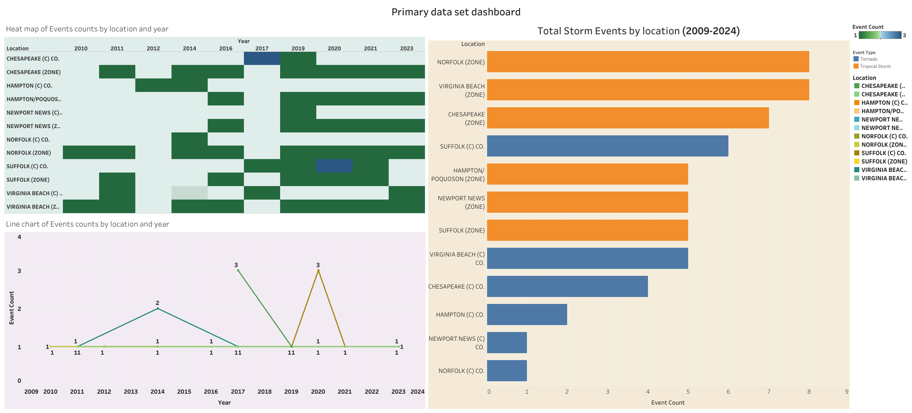

# Olamide Afolabi | Data Science Portfolio

Welcome to my data science portfolio! I am a Data Science student specializing in transforming complex data into actionable business intelligence. My work spans predictive modeling, statistical programming, and interactive visual analytics.

---

## 🛠️ Technical Toolkit
*   **Languages:** Python (Pandas, NumPy, Scikit-Learn), R Studio, SQL
*   **Data Visualization:** Tableau Desktop, Matplotlib, Seaborn
*   **Methodologies:** Statistical Analysis, Predictive Modeling, Regression, Data Cleaning & ETL

---

## 💻 Data Science & Programming Projects

### 🐍 [Automated Data Analysis Pipeline & Modeling](https://github.com/Fola-b3/fall25-mcw-Fola-b3/tree/main/project)
Developed a robust Python-based analytical workflow tailored for data preprocessing, exploratory data analysis (EDA), and predictive performance evaluation.
*   **Core Engineering:** Built structured data cleaning and transformation pipelines handling missing values, encoding, and feature alignment.
*   **Statistical Evaluation:** Implemented machine learning architectures to discover key variable relationships and predict target outcomes.
*   **Business Value:** Translates raw, unformatted datasets into structured, production-ready inputs for reliable downstream statistical inference.

---

## 📊 Tableau BI Dashboards & Business Reports

### 🏪 Superstore Operational Performance Analysis (BNAL 403 Term Project)
An end-to-end executive analysis identifying underlying profit leaks and supply chain frictions across United States operational regions. 
📥 **[Download the Tableau Packaged Workbook (.twbx)](./Afolabi_Olamide_BNAL 403 project.twbx)** 
#### 📄 Executive Report Summary
*   **The Problem:** While top-line sales are strong, significant profit degradation occurs due to aggressive discounting strategies and systemic regional variance in return metrics.
*   **Strategic Recommendations:**
    1.  **Implement a 20% Discount Cap on Furniture:** Analysis shows that the *Tables* sub-category consistently operates at a net loss. Capping discounts at 20% protects product margins from dropping below baseline cost structures.
    2.  **Regional Return Investigations & Logistics Optimization:** Return rates fluctuate heavily by region, incurring excessive shipping and restocking overhead. Regional managers in high-frequency return states must audit root causes while local logistics isolate alternative, cost-efficient carrier routes.
*   **Conclusion:** Addressing these localized operational inefficiencies requires zero net-new capital expenditure but directly shields regional bottom-line profitability.

***

### 🌪️ Regional Storm & Tornado Event Tracking (2009–2024)
A dual-dashboard suite designed to map severe weather incidents and isolate high-risk zones across regional municipalities.

#### **Primary Data Set Dashboard**
Features a synchronized spatial heat map and localized trend analysis detailing overall historical event counts across specific zones.

#### **Severe Tornado Trend Analysis**
Isolates severe tornado trends over a 15-year horizon, tracking localized spike frequencies to assist risk assessment and emergency readiness models.
.png)

***

### ⌚ Bellabeat Consumer Smart Device Case Study
An exploratory health-tracker analysis focused on mapping biometric user trends to optimize consumer wellness app engagement strategies.
*   **Key Insight:** Monitored activity cycles demonstrate that while users maintain stable step counts early in the week, daily active goals drop off significantly by mid-week, uncovering prime programmatic windows for user re-engagement push notifications.
.png)

---

## 📫 Connect with Me
*   **GitHub:** [@Fola-b3](https://github.com/Fola-b3)
*   **LinkedIn:** [@OlamideAfolabi}(www.linkedin.com/in/olamide-afolabi-)
