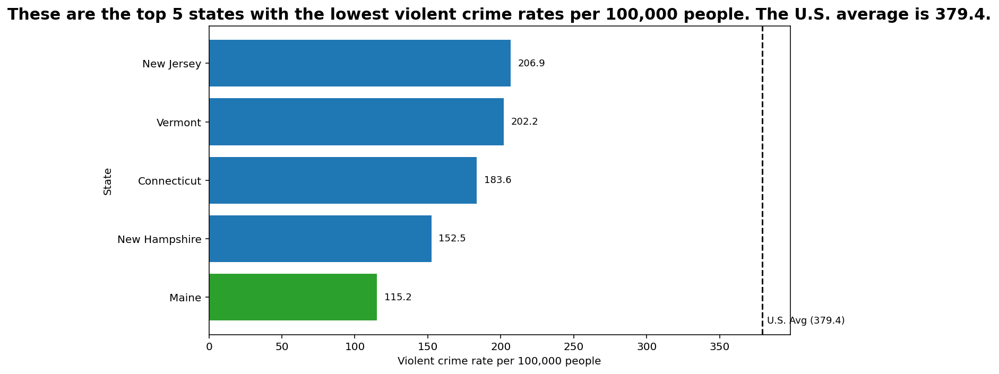

<h1 align="center">Olamide Afolabi </h1>

<h1 align="center">CS 625, Fall 2025</h1>

<h1 align="center">Final Project</h1>

<h1 align="center">Topic: Exploring the Top 5 safest states in the USA</h1>

For this final project, I was thinking about exploring crime statistics in the United States. I was able to locate a crime dataset that was curated by a collaboration between the U.S. Department of Justice and the Federal Bureau of Investigation. The dataset covers reported incidents from 1960 through 2019 for 2 groups, property crimes—which include burglary, larceny, and motor-vehicle offenses—and violent crimes, such as assault, murder, rape, and robbery. For this analysis, I will only be examining the violent crimes portion.

Here is a copy of the dataset: [Dataset](state_crime(2).csv)

Here is a copy of the link for the data source:https://corgis-edu.github.io/corgis/csv/state_crime/

## Question

For this project the question I asked was- What are the top 5 safest states in the USA when it comes to violent crimes?

The first thing I did was clean the data set, i loaded the CSV file and kept only relevant columns, which were State, Year, Data.Population, Data.Rates.Violent.All, Data.Totals.Violent.All. Since i was only exploring the years between 2000 to 2019 so i filtered record years to years 2000 2019. I removed the aggregate 'United States' row to keep only individual states for easy calculation and analysis. I converted population, rate, and total-violent columns to numeric and dropped rows with missing values. Lastly, I selected the latest year in the filtered data for ranking. I did the cleaning using python.

Here is a copy of my python code - [Python file](cleaned_dataset.py)

Here is a copy of my cleaned crime dataset: [Dataset](cleaned_crime_data.csv) 

## Analysis

For the plotting portion of my project, I loaded the cleaned dataset cleaned_crime_data.csv and only the most recent year available 2019 was selected to ensure an up-to-date comparison among states. I sorted the states in an ascending order based on their violent crime rate using the column Data.Rates.Violent.All. I then extracted the five states with the lowest rates to form the comparison group. The ranking provided a concise view of the safest locations. During my progress check 2, the professor suggested I create an average rate for all states. I calculated an average rate to give a meaningful baseline against which each state can be compared, this was done by dividing the Total Violent Crimes Nationwide with the Total U.S. Population and multiplying by 100,000. 

For this chart I choose a horizontal bar chart because ranking is easier to read from top to bottom, the state names fit cleanly and are readable and the differences between states become visually obvious. I added the average reference line to my chart in order to give the perception of what the average is and how low compare to it the safest states are. I plotted it with the use of python.

Here is a copy of my python code - [Python file](top5states.py)

Here is the bar chart visualizing my findings:

Idiom: Bar Chart / Mark: Line
| Data: Attribute | Data: Attribute Type  | Encode: Channel | 
| --- |---| --- |
| Violent Crime rate | key, ordered| separate, horizontal position (x-axis) |
| States | value, quantitative | aligned vertical position (y-axis) |

The analysis of the crime data identified the Top 5 Safest States based on violent crime rates per 100,000 residents. The US average is 379.4. The five states with the lowest rates were:

1. Maine - 115.2

2. New Hampshire - 152.5

3. Connecticut - 183.6

4. Vermont - 202.2

5. New Jersey - 206.9

## Final Thoughts

Each of these states exhibited violent crime levels below the national average. Maine is ranked the safest, is the lowest violent crime rate in the country, with each subsequent state showing only modest increases. The results suggest a strong case of low violent crime rates in the northeastern section of the United States. Maine, New Hampshire, Vermont, Connecticut and New Jersey consistently rank among the safest states due to factors such as lower population density in rural areas, strong community networks, effective state-level policing strategies and socioeconomic conditions that may contribute to reduced violent crime.

The most time tasking part of the process was the cleaning, making sure the output is the right data that can be used to plot the chart and it took me about a week to get right.

## References

How To Record Your FACE and SCREEN on Your Mac-https://youtu.be/HL_PkylpbG8?si=3zYFQuO7vvtuSAO4

Python Tutorial for Beginners #13 - Plotting Graphs in Python (matplotlib) - https://youtu.be/X69y9N65Iu8?si=o2RylBA5awWgC42C

Matlab Tutorial - 60 - Plotting Functions-https://youtu.be/EbDJNjYZ-EA?si=FVLGUD7ezLq4OtO-

